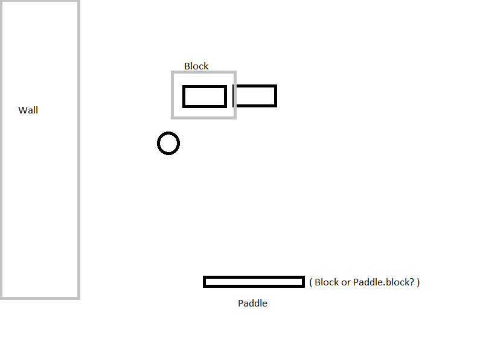

# ChangeLog

### Version 0.3.0
All special functions completed!
Detail changes can be found on [Github](https://github.com/ThreeCatsLoveFish/Duality).

### Version 0.2.1
##### 2020.6.6 VG-100 Group-18
#### Milestone 2
All basic functions completed!

### Version 0.2.0
##### 2020.5.14 By Yuchen Jiang
#### Some changes on data model and control flow
To complete Milestone 2, we need a new structure.
Setup the whole structure:
```
|- Main.elm
|- Bin
   |- Initial.elm
   |- Message.elm
   |- Test.elm
   |- Types.elm
   |- Update.elm
   |- View.elm
|- ...
```
*Note: this version of p1 is not `Playground` based and is not compatible to the former one. Also, this version is merely a draft, which means it has implemented nothing but data models and tools to debug...*
#### Data Model
`Bin.Types` contains all the Data needed for View and Update, which are:
1 . Point --> a vector
```
type alias Point =
    { x : Float
    , y : Float
    }
```
2 . Block --> a rectangle marked by two Points, which roughly defines a pre-checking box area [^Why_Block]
```
type alias Block =
    { lb : Point -- left bottom
    , rt : Point -- right top
    }
```
[^Why_Block]: The goal of Block was initially reduce calculation pressure (or it's just grammar laziness (X_X)).
It works like: 
3 . Brick, Wall, Ball, Paddle
```
type alias Brick =
    { pos: Point -- may not be necessary
    , collision: Poly -- for hitCheck
    , block: Block
    , stat: BrickStat
    --, visual: Visual -- can get by collision
    }
type alias Wall =
    { block: Block
    }
type alias Ball =
    { pos: Point
    , v: Point -- Could be a function related to time?
    , r: Float
    {-
    , collision: Poly -- save for future change
    , visible: Float/Visible -- save for future change
    -}
    --, visual: Visual
    }
type alias Paddle =
    { pos: Point -- may not be necessary
    , collision: Poly -- for hitCheck
    , block: Block
    , stat: PaddleStat
    --, visual: Visual -- can get by collision
    }
```
4 . Menu & Game
```
-- Menu: see control flow
type alias Model =
    { ball: Ball
    , bricks: List Brick
    , paddle: Paddle
    , menu: Menu
    }
```
#### Control Flow
##### This part is contributed by Yuchen Zhou.
Msg: 
```
type Op
    = Left
    | Right
    | Stay -- maybe useless..

type Menu
    = Startup -- before start; welcome
    | Paused  -- stop updating game model, still updating the menu, show Paused
    | Win -- stop game model and frame, still menu, show Win
    | Lose -- stop game model and frame, still menu, show Win
    | NoMenu -- just in case...

type Msg
    = Running Op -- running the game, update and view
    | ShowMenu Menu -- show menu on top
    | NoOp -- somehow redundant...
```
Ideally, this is conveyed to update by subscriptions per 1/30 sec.

We've come to a point where work can be divided:
```
moveBall : GameModel -> GameModel
movePaddle : GameModel -> GameModel
collisionCheck : GameModel -> GameModel
gameStatus : GameModel -> GameModel
brickStatus : GameModel -> GameModel
winOrLose : GameModel -> GameModel
```

---

### Version 0.1 Series Abort
##### 2020.5.23 By Zhimin Sun
Since I wrote the *0.1* series with Elm-Playground, it is aborted now.
All functions will not be updated.

### Version 0.1.1
##### 2020.5.21 By Zhimin Sun
#### Fix Bug
- The ball will not bounce left or right.
#### New Functions
1. The speed of ball will change when it touches the moving board.
2. Ball will bounce back when it hit the corner of bricks or board.

### Version 0.1.0
##### 2020.5.17 By Zhimin Sun
#### Release the first basic version
All basic functions complete

---

### Version 0.0 Series Finish

### Version 0.0.1
##### 2020.5.17 By Zhimin Sun
#### Main change
1. **Add usage of this game.**
1. Optimize the structure and add comments.
1. Add bricks, and the function of break bricks.
1. Leave the init part of bricks for further design.
1. Add the winner part!
1. Change the traditional number to data (easier to change). 

### Version 0.0.0
##### 2020.5.14 By Zhimin Sun
#### Main change
Setup the whole structure:
```
|- Main.elm
|- Components
   |- Structure.elm
   |- Init.elm
   |- View.elm
   |- Update.elm
|- ...
```
#### Functions so far
1. The **start** and **end** UI.
1. The ball can bounce between walls, and the board that users control.
1. Board can move left and right, and won't go beyond the walls. 
